# MedImg Denoise

Open-source toolkit for **medical image noise removal** and **visual enhancement**.

Compare classical spatial filters on MRI / bone / ultrasound-style scans, then apply point-processing transforms to improve contrast and structure visibility. Everything is reproducible from the CLI.

<p align="center">
  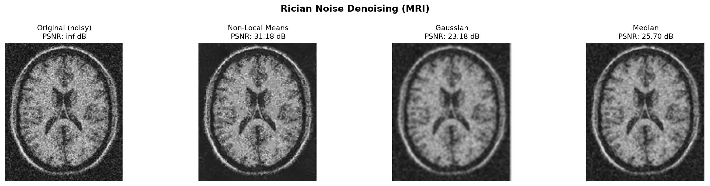
</p>

---

## Features

- **Noise pipelines** for Rician, salt & pepper, Gaussian, periodic, and speckle noise
- **Filters:** Median, Gaussian, Bilateral, Non-Local Means, Wiener, hybrid cascades, mean-shift
- **Enhancement:** negative, threshold, grey-level slice, contrast stretch, histogram equalization, log / inverse-log, gamma, bit-plane slicing, Laplacian–Sobel sharpening
- **Sample scans** under `data/samples/` plus a ready-made **result gallery**
- **PSNR metrics** written to `gallery/metrics.json`

---

## Quick start

```bash
python3 -m venv .venv
source .venv/bin/activate   # Windows: .venv\Scripts\activate
pip install -r requirements.txt
python src/run_study.py
```

---

## Denoising results

| Noise | Typical source | Strong default |
|---|---|---|
| Rician | Magnitude MRI | Non-Local Means / Median |
| Salt & pepper | Impulse / transmission | **Median** |
| Gaussian | Electronic / thermal | Bilateral / Median |
| Periodic | Interference striping | Bilateral (FFT notch for severe cases) |
| Speckle | Ultrasound / coherent imaging | Hybrid Median + Bilateral |

### Example comparisons

| Rician (MRI) | Salt & pepper (bone) |
|---|---|
| 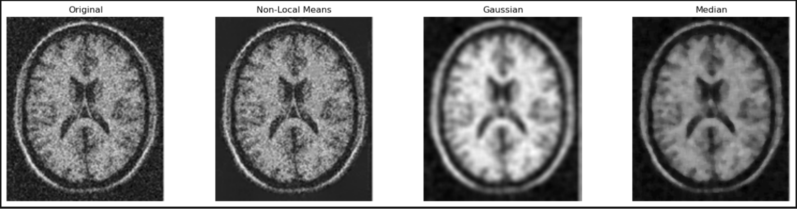 | 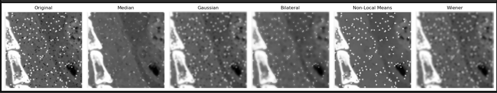 |

| Gaussian | Speckle |
|---|---|
| 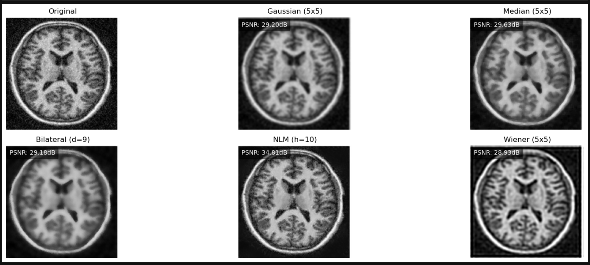 | 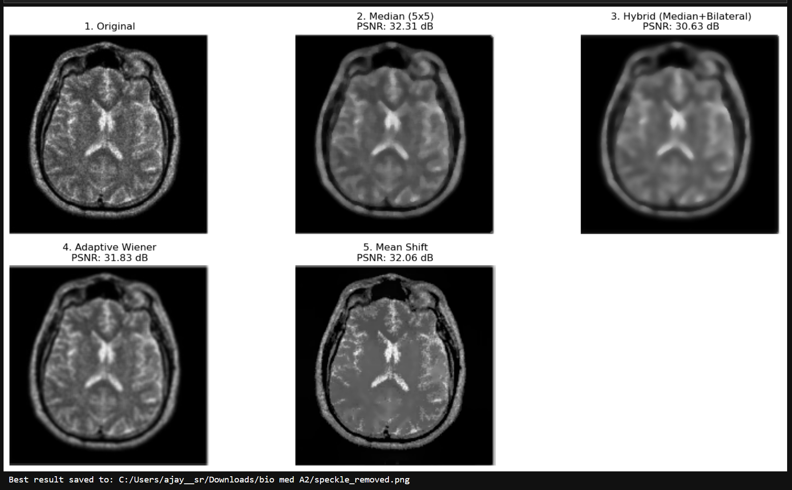 |

Fresh grids regenerated by the pipeline live in [`gallery/denoising/`](gallery/denoising/).

---

## Enhancement examples

| Negative | Threshold | Gamma |
|---|---|---|
| 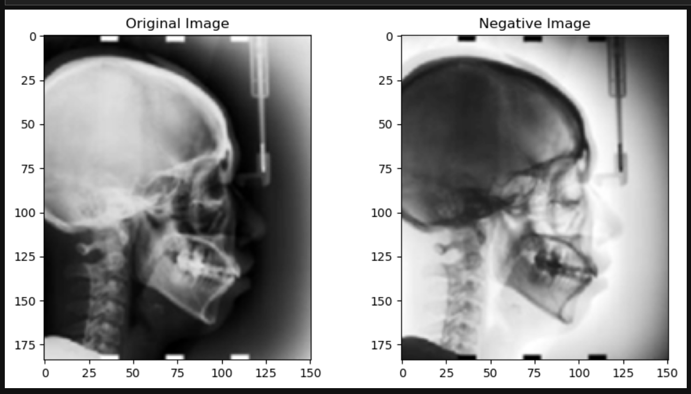 | 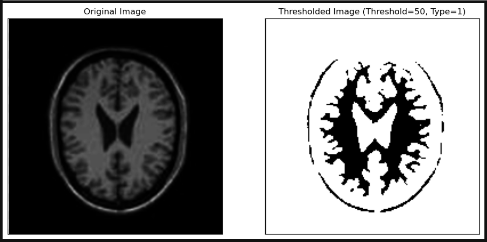 | 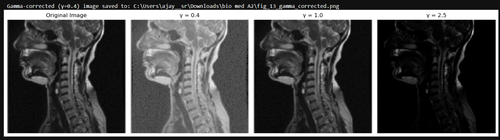 |

| Histogram EQ | Bit planes | Sharpen / mask |
|---|---|---|
| 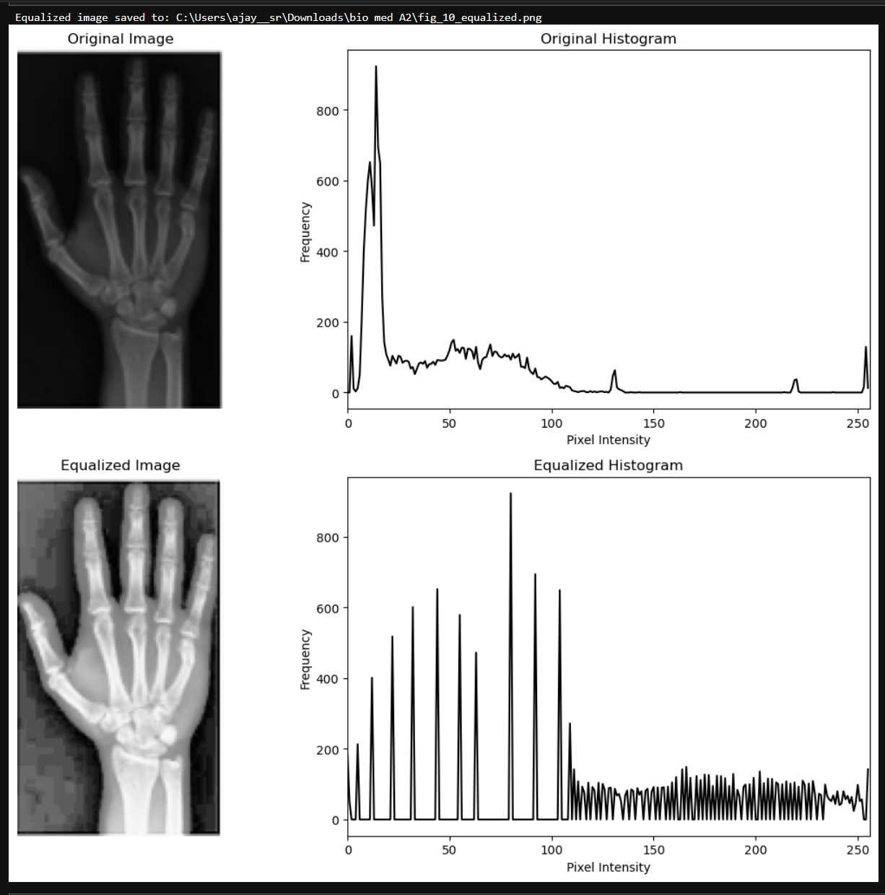 | 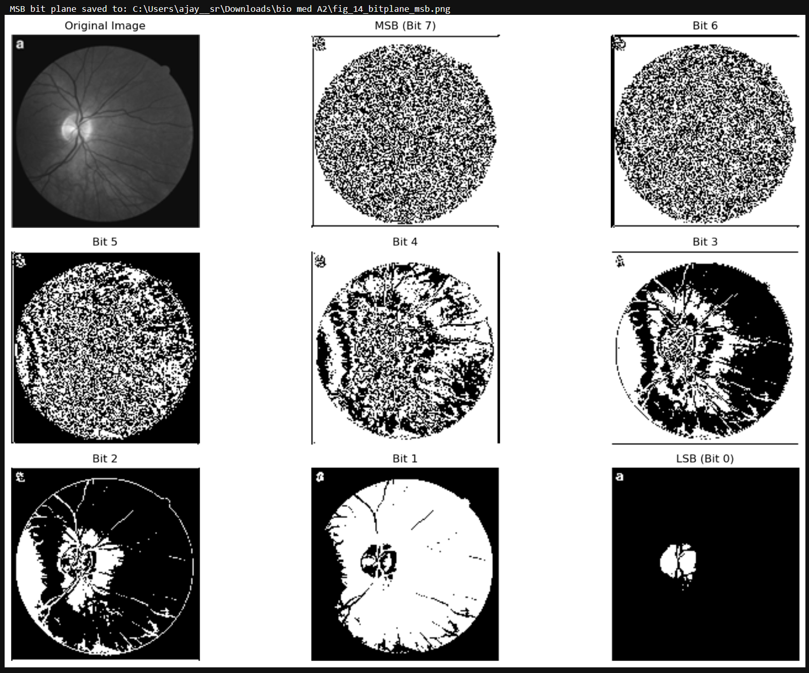 | 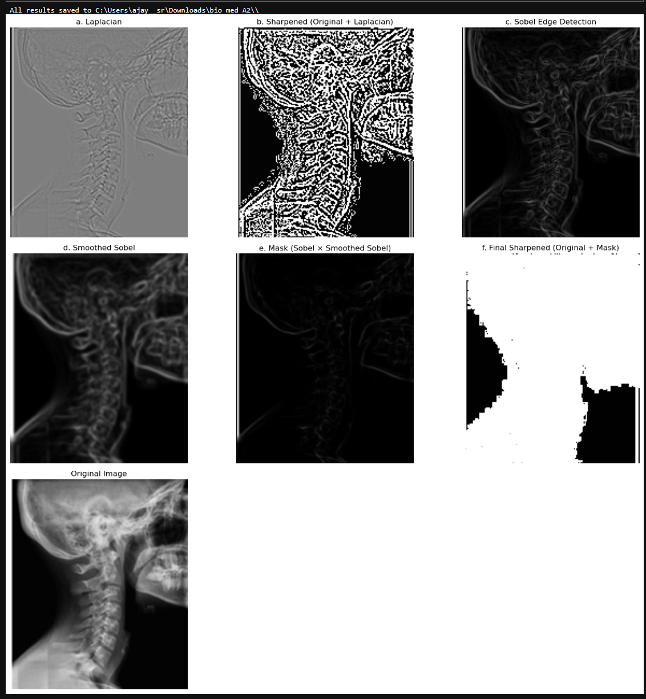 |

More panels: [`gallery/enhancement/`](gallery/enhancement/) · [`gallery/captures/`](gallery/captures/)

---

## Project layout

```
data/samples/          # noisy medical sample images
gallery/denoising/     # filter comparison grids (pipeline output)
gallery/enhancement/   # enhancement grids (pipeline output)
gallery/captures/      # curated demo screenshots
src/
  phantoms.py          # synthetic phantoms + noise models
  denoise.py           # noise-specific filter pipelines
  enhance.py           # point processing & intensity transforms
  utils.py             # PSNR, I/O helpers
  run_study.py         # end-to-end runner
```

---

## How to use your own images

Point any pipeline at a grayscale PNG/JPG:

```python
from denoise import denoise_salt_pepper
import cv2

img = cv2.imread("path/to/noisy.png", cv2.IMREAD_GRAYSCALE)
results = denoise_salt_pepper(img)
cv2.imwrite("median.png", results["Median"])
```

---

## Stack

Python · OpenCV · NumPy · Matplotlib · scikit-image

---

## License

MIT
